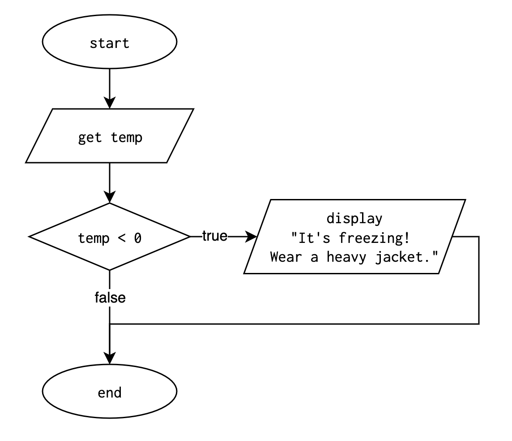
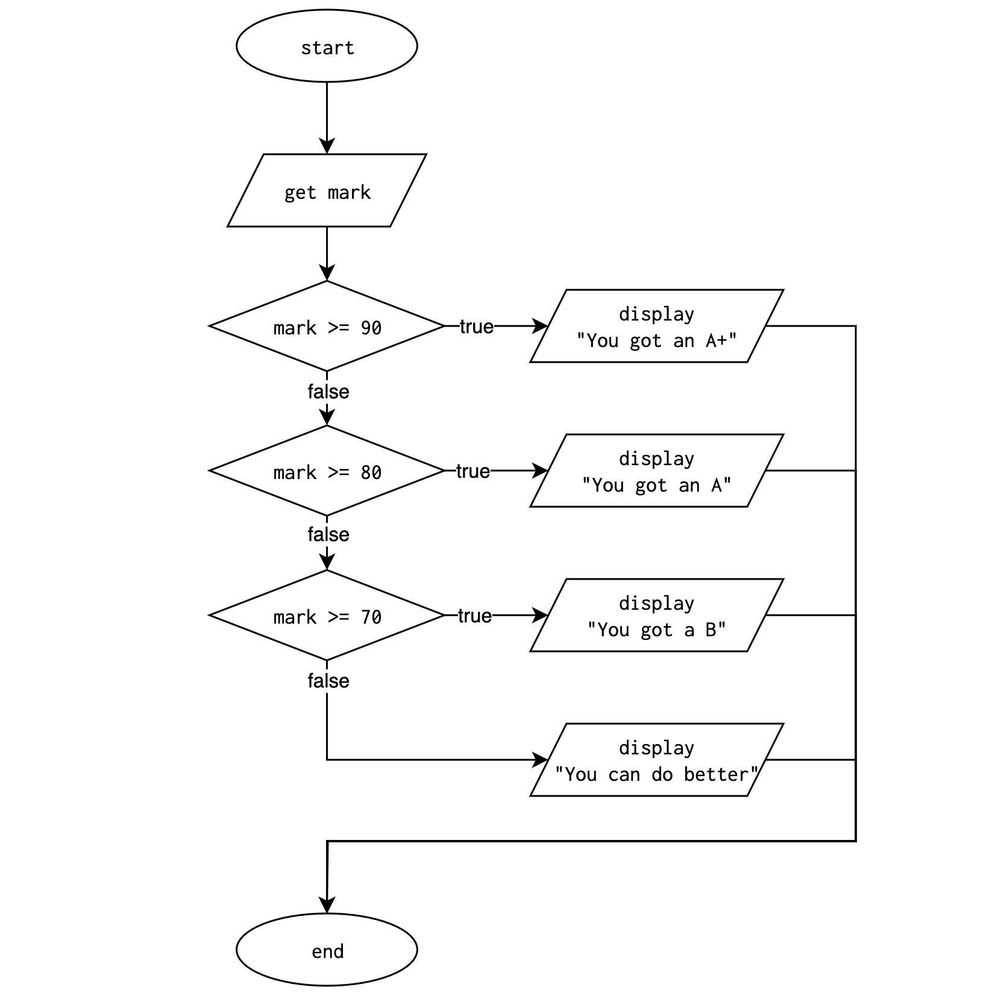
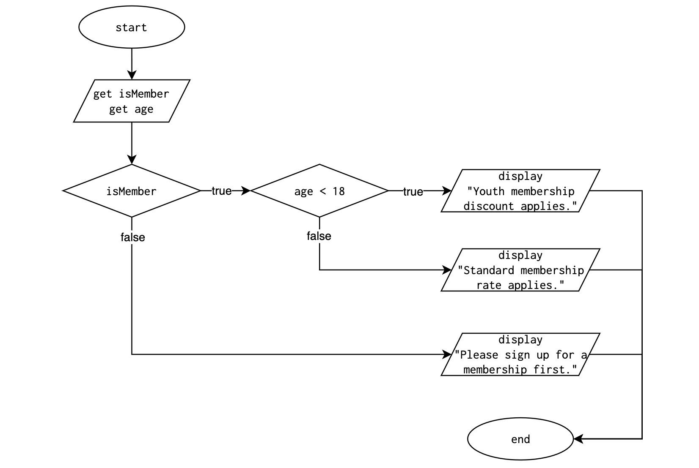

# Lesson: If Statements

**Previous Lesson:** [Logical Operators & Expressions](https://github.com/SACHSTech/Lesson-Logical-Operators-and-Expressions)

## Introduction

In programming, we often need to make decisions — to execute certain parts of the code only when specific conditions are true. This concept is known as **conditional execution**, and it’s achieved using the **if statement**.

Conditional statements allow programs to respond dynamically to input and logic, rather than executing the same sequence every time.

## 1. Conditional Execution

The simplest form of an `if` statement checks a condition, and if that condition is `true`, it executes the indented code block.

```java
int temp = readInt("Enter the outside temperature: ");

if (temp < 0) {
    System.out.println("It’s freezing! Wear a heavy jacket.");
}
```

* The boolean expression inside the parentheses is called the **condition**.
* If the condition is **true**, the body (the indented statements) executes.
* If it is **false**, the body is skipped.

Use **conditional execution** when you only need to check one specific possibility.

**Flowchart:**


<br><br>

## 2. Alternative Execution

When there are **two** possible outcomes — one for `true`, another for `false` — use `if` and `else`.

```java
int number = readInt("Enter a number: ");

if (number % 2 == 0) {
    System.out.println("The number is even.");
} else {
    System.out.println("The number is odd.");
}
```

* If the remainder when dividing by 2 is 0, it prints *even*.
* Otherwise, it prints *odd*.
* Only **one** branch executes.

**Flowchart:**


<br><br>

## 3. Chained Conditionals

Chained conditionals handle **multiple** conditions in sequence using `else if`.

This is great for problems with **exclusive categories**, like grade cutoffs:

```java
int mark = readInt("Enter your mark: ");

if (mark >= 90) {
    System.out.println("You got an A+");
} else if (mark >= 80) {
    System.out.println("You got an A");
} else if (mark >= 70) {
    System.out.println("You got a B");
} else {
    System.out.println("You can do better");
}
```

* The program checks each condition **top to bottom**.
* As soon as one is true, the rest are skipped.
* Only **one branch** executes.

**Flowchart:**


**Use a chained conditional** when your program needs to pick *exactly one* outcome from several possibilities.

<br><br>

## 4. Nested Conditionals

A **nested conditional** is an `if` statement inside another `if` or `else`. It’s useful for multi-level decisions.

```java
boolean isMember = readBoolean("Are you a gym member? ");
int age = readInt("Enter your age: ");

if (isMember) {
    if (age < 18) {
        System.out.println("Youth membership discount applies.");
    } else {
        System.out.println("Standard membership rate applies.");
    }
} else {
    System.out.println("Please sign up for a membership first.");
}
```

* The **outer** `if` checks if the user is a member.
* The **inner** `if` runs only if the outer one was true.

**Flowchart:**


**Difference from Chained:**
- **Chained:** all conditions are checked *independently and sequentially*.
- **Nested:** one condition is checked *inside another*, like a hierarchy.

While nesting can be powerful, deep nesting makes code **harder to read**. When possible, rewrite nested logic as chained `else if` statements.

<br><br>

## Practice Problems: If Statements

### 1. Comparing Two Numbers
Fill in the missing condition so that the program prints which number is greater.

```java
int a = readInt("Enter first number: ");
int b = readInt("Enter second number: ");

if ( ________ ) {
    System.out.println("First number is greater.");
}
```

<br><br>

### 2. Positive or Negative
Write an `if` statement that checks whether a number is positive or negative.  
If it’s `0`, print `"Zero"`.

```java
int num = readInt("Enter a number: ");
```

Expected output examples:
```
Enter a number: 5
Positive
```
```
Enter a number: -2
Negative
```

<br><br>

### 3. Password Length Check
Fill in the blanks to check if a password is long enough to meet an **8 character minimum length requirement**.

```java
String password = readLine("Enter password: ");
int length = password.length();

if ( ________ ) {
    System.out.println("Password is strong enough!");
} else {
    System.out.println("Password is too short.");
}
```

<br><br>

### 4. Delivery Fee Calculator
Customers pay a delivery fee based on distance:
- Less than 5 km → Free
- 5–20 km → $5
- Over 20 km → $10

Write the logic to output the correct delivery cost.

Sample output:
```
Enter distance: 3
Delivery cost: $0
```
```
Enter distance: 15
Delivery cost: $5
```
```
Enter distance: 25
Delivery cost: $10
```

<br><br>

### 5. Scholarship Eligibility
A student qualifies for a scholarship if:
- Grade 12 average is 90 percent or higher
- At least 40 community service hours

Otherwise, print `"Not eligible"`.

Example run:
```
Enter average: 95
Enter hours: 45
Scholarship granted!
```
```
Enter average: 89
Enter hours: 50
Not eligible
```

<br><br>

### 6. Library Fine Calculator
Compute the fine based on overdue days:
- 0 days → “No fine”
- 1–5 days → $1 per day
- 6–10 days → $2 per day
- 11+ days → $5 per day

Print the total fine.

Sample output:
```
Enter days overdue: 8
Total fine: $16
```

<br><br>

### 7. Roller Coaster Eligibility
Ask for height (cm) and age.  
A person can ride if both:
- Age is 10 or older
- Height is 120 cm or taller

Otherwise, print `"Sorry, you can’t ride."`

Sample output:
```
Enter age: 12
Enter height: 130
You can ride!
```
```
Enter age: 8
Enter height: 135
Sorry, you can’t ride.
```

<br><br>

### 8. Ontario Stunt Driving Penalties
Under Ontario's Highway Traffic Act, a driver is considered to be *stunt driving* if they are going 50 km/h or more over the posted speed limit on roads with a limit of 80 km/h or higher, or 40 km/h or more over the limit on roads with a limit less than 80 km/h. 

The penalty for stunt driving is a roadside vehicle impound and a 30-day license suspension.

Ask the driver for the posted speed limit and their observed speed, then output whether they are stunt driving or not.

Sample output:
```
Enter speed limit: 100
Enter observed speed: 155
Stunt driving. License suspension and vehicle impound.
```
```
Enter speed limit: 40
Enter observed speed: 82
Stunt driving. License suspension and vehicle impound.
```
```
Enter speed limit: 90
Enter observed speed: 130
Speeding ticket. Fine and demerit points.
```
```
Enter speed limit: 60
Enter observed speed: 90
Speeding ticket. Fine and demerit points.
```

<br><br>

### 9. Electricity Bill Calculator
Suppose an electric utility bills usage at its own rate, similar to income tax brackets.

| Usage Tier (kWh) | Rate per kWh |
|-----------------:|:-------------:|
| First 100        | $0.10         |
| Next 100 (101–200) | $0.15       |
| Above 200        | $0.25         |

Plus, add a flat **$10 service fee** to every bill.

#### Example Runs:
```
Enter usage: 85
Bill = 18.5
```
```
Enter usage: 150
Bill = 27.5
```
```
Enter usage: 250
Bill = 47.5
```
```
Enter usage: 400
Bill = 85.0
```

**Explanation (for 400 kWh):**
- First 100 × $0.10 = $10  
- Next 100 × $0.15 = $15  
- Remaining 200 × $0.25 = $50  
- Plus $10 service fee
- **Total is $85**

<br><br>

### 10. Movie Ticket Discount Calculator

Create a program to determine a customer's movie ticket price based on their **age** and **day of the week**.

Rules:
- Regular ticket price is **$12**
- Children under **12** get **50% off**
- Seniors (**65+**) get **25% off**
- **Tuesdays** are **50% off for everyone** (no other discounts apply on Tuesday)

Ask for the user's age and the day of the week, then calculate and print the final price.

#### Example Runs:
```
Enter age: 10
Enter day: Sunday
Ticket price: $6.0
```
```
Enter age: 70
Enter day: Tuesday
Ticket price: $6.0
```
```
Enter age: 40
Enter day: Friday
Ticket price: $12.0
```
```
Enter age: 68
Enter day: Wednesday
Ticket price: $9.0
```
```
Enter age: 16
Enter day: Tuesday
Ticket price: $6.0
```