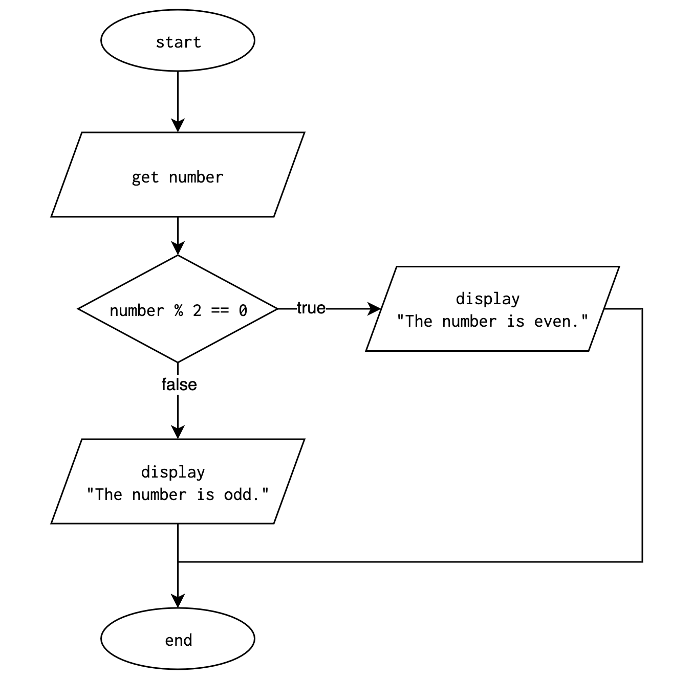

# Lesson: If Statements

**Previous Lesson:** [Logical Operators & Expressions](https://github.com/SACHSTech/Lesson-Logical-Operators-and-Expressions)

## Introduction

In programming, we often need to make decisions — to execute certain parts of the code only when specific conditions are true. This concept is known as **conditional execution**, and it’s achieved using the **if statement**.

Conditional statements allow programs to respond dynamically to input and logic, rather than executing the same sequence every time.


## 1. Conditional Execution

The simplest form of an `if` statement checks a condition, and if that condition is `true`, it executes the indented code block.

```java
int temp = readInt("Enter the outside temperature: ");

if (temp < 0) {
    System.out.println("It’s freezing! Wear a heavy jacket.");
}
```

* The boolean expression inside the parentheses is called the **condition**.
* If the condition is **true**, the body (the indented statements) executes.
* If it is **false**, the body is skipped.

💡 Use **conditional execution** when you only need to check one specific possibility.

**Flowchart:**


## 2. Alternative Execution

When there are **two** possible outcomes — one for `true`, another for `false` — use `if` and `else`.

```java
int number = readInt("Enter a number: ");

if (number % 2 == 0) {
    System.out.println("The number is even.");
} else {
    System.out.println("The number is odd.");
}
```

* If the remainder when dividing by 2 is 0, it prints *even*.
* Otherwise, it prints *odd*.
* Only **one** branch executes.

**Flowchart:**


## 3. Chained Conditionals

Chained conditionals handle **multiple** conditions in sequence using `else if`.

This is great for problems with **exclusive categories**, like grade cutoffs:

```java
int mark = readInt("Enter your mark: ");

if (mark >= 90) {
    System.out.println("You got an A+");
} else if (mark >= 80) {
    System.out.println("You got an A");
} else if (mark >= 70) {
    System.out.println("You got a B");
} else {
    System.out.println("You can do better");
}
```

* The program checks each condition **top to bottom**.
* As soon as one is true, the rest are skipped.
* Only **one branch** executes.

**Flowchart:**


**Use a chained conditional** when your program needs to pick *exactly one* outcome from several possibilities.

## 4. Nested Conditionals

A **nested conditional** is an `if` statement inside another `if` or `else`. It’s useful for multi-level decisions.

```java
boolean isMember = readBoolean("Are you a gym member? ");
int age = readInt("Enter your age: ");

if (isMember) {
    if (age < 18) {
        System.out.println("Youth membership discount applies.");
    } else {
        System.out.println("Standard membership rate applies.");
    }
} else {
    System.out.println("Please sign up for a membership first.");
}
```

* The **outer** `if` checks if the user is a member.
* The **inner** `if` runs only if the outer one was true.

**Difference from Chained:**
- **Chained:** all conditions are checked *independently and sequentially*.
- **Nested:** one condition is checked *inside another*, like a hierarchy.

**Flowchart:**


While nesting can be powerful, deep nesting makes code **harder to read**. When possible, rewrite nested logic as chained `else if` statements.

<br><br>

## Practice Problems: If Statements

### Problem 1 — Temperature Check
Ask for the outdoor temperature and print a clothing recommendation.

<br><br>

### Problem 2 — Even or Odd
Ask for a number and print whether it’s even or odd.

<br><br>

### Problem 3 — GPA Category
Ask for a GPA between 0.0–4.0 and print the category:
- 3.7–4.0 → "Excellent"
- 3.0–3.6 → "Good"
- 2.0–2.9 → "Satisfactory"
- Below 2.0 → "Needs Improvement"

<br><br>

### Problem 4 — Leap Year Check
Use nested conditionals to determine if a year is a leap year.

<br><br>

### Problem 5 — Gym Membership
Determine whether a customer qualifies for a discount using nested `if` statements (see example above).

<br><br>

### Problem 6 — Bonus Challenge: Ticket Price Logic
Design a program that asks for age and day of the week. Compute the movie ticket price using these rules:
- Regular price: $12
- Seniors (65+) get 25% off
- Children under 12 get 50% off
- Tuesdays have 50% off for everyone

Output the final ticket price.

<br><br>

## Summary of Skills Practiced
- Using `if`, `else`, and `else if`
- Distinguishing between chained vs. nested conditionals
- Building readable, structured control flow
- Applying logic to real-world decisions

